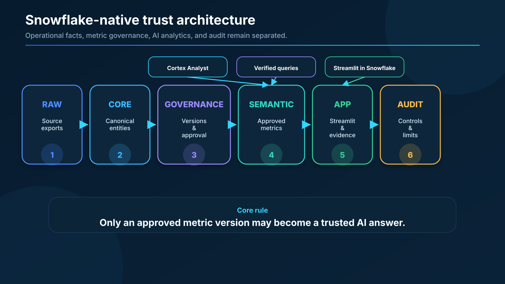

# ChainProof

> **One KPI name. Three valid calculations. One governed enterprise answer.**

ChainProof is a Snowflake-native metric trust and reconciliation platform for supply-chain analytics. It detects when Planning, Procurement, and Logistics use the same KPI label for different business questions, compares the competing definitions, records a human governance decision, publishes only the approved version, and lets Cortex Analyst answer with visible calculation evidence.

## The problem in ten seconds

For the same laptop-battery Purchase Order, three teams can report:

| Team | Correctly named metric | Result |
|---|---|---:|
| Planning | Material Availability Rate | **95%** |
| Procurement | Supplier Accepted Fill Rate | **85%** |
| Logistics | On-Time Arrival Quantity Rate | **90%** |

All three can be mathematically correct. The danger is calling all of them **Fill Rate** and letting an AI assistant choose one without governance.

ChainProof resolves that ambiguity and publishes:

> **Enterprise Supplier Fill Rate v1.0 = 85% for PO-5001**

## Start here

| Reviewer need | Open this |
|---|---|
| See the working product | [Live Streamlit application](https://app.snowflake.com/SFEDU05/nxb07453/#/streamlit-apps/CHAINPROOF.APP.CHAINPROOF_APP) |
| Watch the complete story | [6 minute walkthrough](https://drive.google.com/file/d/1sbCqeRjcNWpvU3oHDjV-CBssD_QQyQaK/view?usp=sharing) |
| Follow the exact click path | [Judge Guide](docs/JUDGE_GUIDE.md) |
| Review the presentation | [PPTX](submission/ChainProof_Hackathon_Presentation.pptx) · [PDF](submission/ChainProof_Hackathon_Presentation.pdf) |
| Understand the architecture | [Architecture](docs/ARCHITECTURE.md) |
| Inspect technical depth | [Technical Appendix](docs/TECHNICAL_APPENDIX.md) |
| FAQs | [FAQs](docs/FAQ.md) |
| Review validation and limits | [Validation Summary](docs/VALIDATION_SUMMARY.md) |

## What makes ChainProof different

A dashboard displays a KPI. A semantic layer publishes an agreed KPI. A data catalog documents a KPI.

**ChainProof governs the disagreement that exists before agreement.**

Its trust lifecycle is:

```text
Detect conflict
→ Compare executable contracts
→ Assess business impact
→ Attach policy and SLA evidence
→ Record Data Steward approval
→ Activate a version
→ Publish to a Semantic View
→ Verify natural-language answers
```

## Product walkthrough

1. **Start Here** - see 95%, 85%, and 90% for PO-5001.
2. **Why Numbers Differ** - compare grain, numerator, denominator, date, damage, and aggregation rules.
3. **Govern the Definition** - replay the pre-approval conflict and the Data Steward decision.
4. **Trusted Enterprise Answer** - inspect Enterprise Supplier Fill Rate v1.0, approval, activation, and publication.
5. **Ask ChainProof** - ask “What is fill rate for PO-5001?” and receive the governed 85% answer.
6. **Evidence & Impact** - inspect source rows, calculation evidence, policy/SLA evidence, and the operational consequence of each governed metric.
7. **Architecture & Trust** - review the Snowflake-native stack, tests, and account limitations.

### Why the app includes `View as`

The hackathon account provides one learner execution role rather than a full production role hierarchy. `View as` therefore demonstrates the **presentation lens** different personas would receive:

- Planning emphasizes production readiness.
- Procurement emphasizes accepted supplier quantity.
- Logistics emphasizes carrier commitments.
- Data Steward sees governance review controls.
- Operations Leader sees the enterprise outcome.

`View as` is **not** a security-role switch. The production RBAC design is documented separately. The formula never changes with the persona.

## Snowflake-native architecture



```text
Source exports
→ CHAINPROOF.RAW
→ CHAINPROOF.CORE
→ CHAINPROOF.GOVERNANCE
→ CHAINPROOF.SEMANTIC
→ CHAINPROOF.APP
→ CHAINPROOF.AUDIT
```

Key capabilities:

- Snowflake SQL and Snowflake CLI
- CoCo CLI-assisted development
- Native Semantic View
- Verified queries
- Cortex Analyst
- Cortex Search when available, with a truthful deterministic fallback
- Streamlit in Snowflake
- Versioned governance and audit controls

## Worked example

```text
PO-5001 ordered:                         100 batteries
Accepted by original PO requested date:  85
Accepted by production need date:         95
Physically delivered by carrier date:     90
```

Therefore:

```text
Planning Material Availability Rate       = 95 / 100 = 95%
Procurement Supplier Accepted Fill Rate    = 85 / 100 = 85%
Logistics On-Time Arrival Quantity Rate    = 90 / 100 = 90%
Enterprise Supplier Fill Rate v1.0         = 85 / 100 = 85%
```

## Validation snapshot

ChainProof includes deterministic validation at every layer:

- RAW file, row-count, key, relationship, and edge-case checks
- CORE typing, canonical-key, lineage, and data-quality checks
- GOVERNANCE definition, version, conflict, approval, and activation checks
- SEMANTIC metric, relationship, verified-query, and direct-result checks
- APP question-scope, read-only SQL, evidence, and persona tests
- AUDIT release controls and known-limitation records

The live Cortex Analyst runtime is working. The official batch evaluation feature could not run under the learner role because it requires account-level task and dataset privileges. This is an automation limitation, not a runtime product failure. See [Validation Summary](docs/VALIDATION_SUMMARY.md).

## Repository map

```text
app/          Streamlit in Snowflake application
 data/        deterministic source and evidence fixtures
 docs/        business contracts, build evidence, judge material
 prompts/     prompt-driven development record
 scripts/     repeatable build and certification commands
 snowflake/   Snowflake objects by implementation part
 submission/  deck, portal copy, and final links
 tests/       fail-fast SQL, Python, UI, and manual gates
```

## Engineering build record

The project was built in controlled parts:

1. Environment
2. Toolchain and repository safety
3. Business scenario and metric contracts
4. RAW source ingestion
5. Canonical CORE layer
6. Metric governance and versioning
7. Semantic View and Cortex Analyst
8. Streamlit product experience
9. Evidence-backed reconciliation
10. Production hardening and audit
11. Reviewer-first submission package
12. Demo and finale readiness

See [Part-by-Part Index](docs/PART_BY_PART_INDEX.md).

## Submission status

- [x] Working Snowflake data and governance layers
- [x] Native Semantic View and verified questions
- [x] Cortex Analyst live questions
- [x] Streamlit in Snowflake application
- [x] Evidence-backed review and deterministic fallback
- [x] Security, audit, and release controls
- [ ] Final public app link inserted
- [ ] Final walkthrough video inserted
- [ ] Final screenshots captured
- [ ] Portal submission completed

## Links

- Public repository: https://github.com/pankajadam-tech/chainproof-snowflake
- Live application: `https://app.snowflake.com/SFEDU05/nxb07453/#/streamlit-apps/CHAINPROOF.APP.CHAINPROOF_APP`
- Walkthrough video: [Watch on Google Drive](https://drive.google.com/file/d/1sbCqeRjcNWpvU3oHDjV-CBssD_QQyQaK/view?usp=sharing)

---

**ChainProof prevents AI from confidently answering the wrong KPI.**
