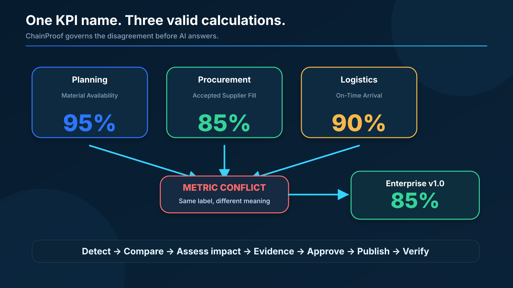
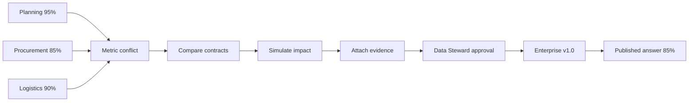
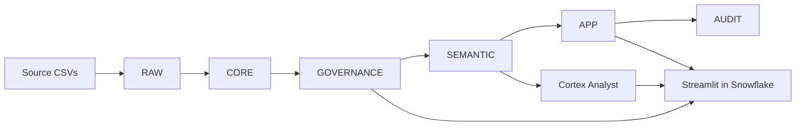
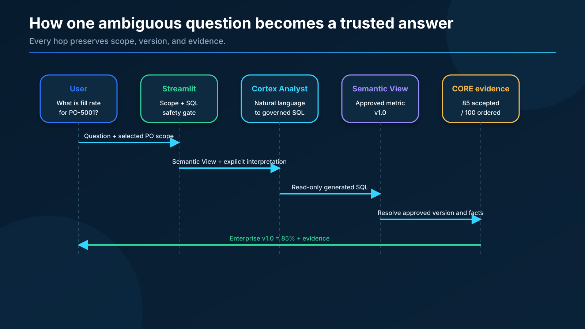
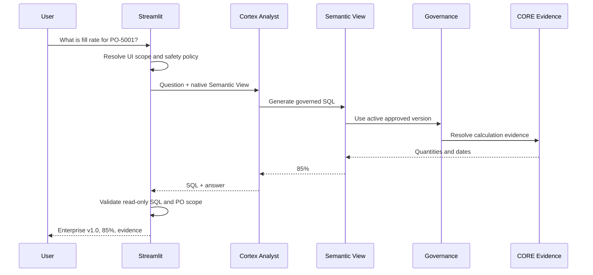
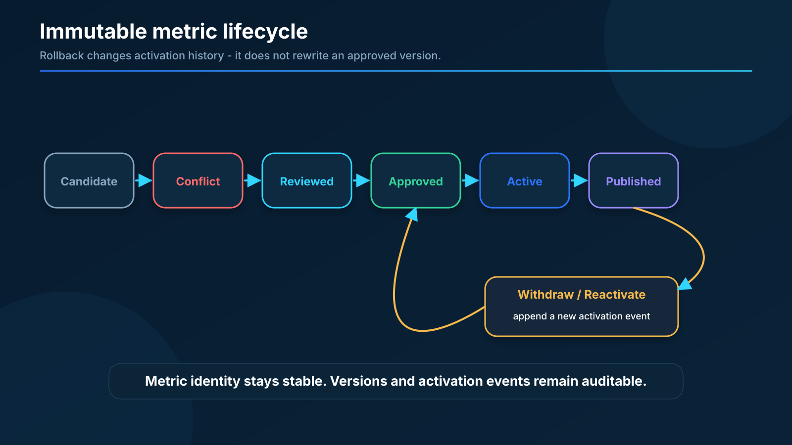
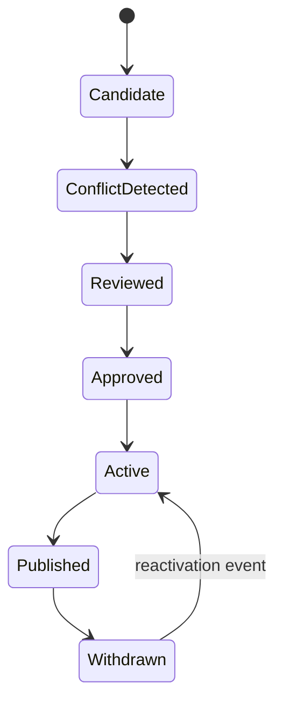
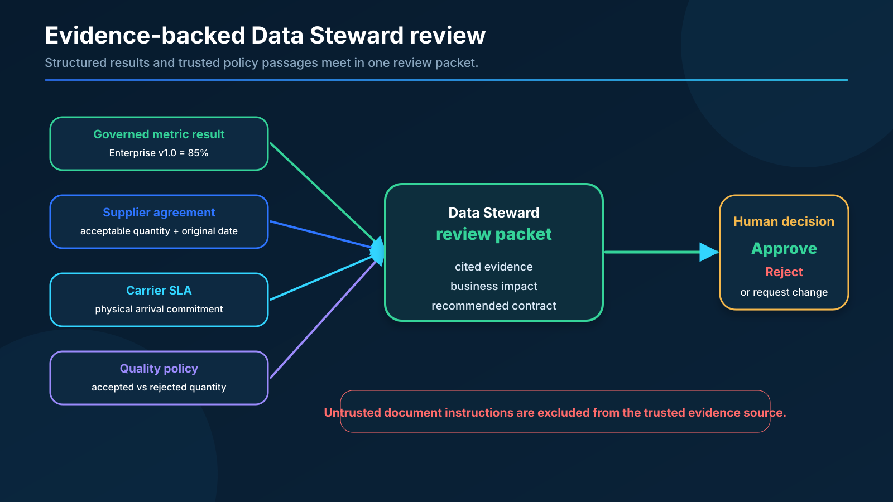
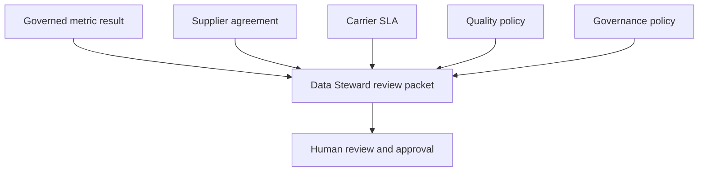

# ChainProof Architecture

## Diagram 1 - Business conflict and governance lifecycle

## Diagram 2 - Snowflake-native system

| Schema | Purpose |
|---|---|
| **RAW** | Preserves source exports as-is |
| **CORE** | Canonicalized, typed entities with lineage |
| **GOVERNANCE** | Metric definitions, versions, approvals, activations |
| **SEMANTIC** | Native Semantic View with verified queries |
| **APP** | Read-only views, Streamlit, Cortex Analyst, evidence |
| **AUDIT** | Release controls and limitation records |

## Diagram 3 - Governed question sequence

## Diagram 4 - Metric version lifecycle

Approved versions are immutable. Rollback is represented through activation history, not by renaming or overwriting an old version.

## Diagram 5 - Evidence-backed decision packet

## Architecture principles

1. **Preserve before cleaning** - RAW retains malformed and incomplete source values.
2. **Canonicalize once** - CORE provides connected, typed entities and lineage.
3. **Version the rule** - GOVERNANCE stores the metric contract and decision history.
4. **Publish only approved definitions** - SEMANTIC excludes candidates and deprecated ambiguity.
5. **Keep the app thin** - Streamlit presents governed Snowflake results rather than reimplementing formulas in Python.
6. **Expose evidence** - every trusted answer can show quantities, dates, version, and policy context.
7. **Fail visibly** - unavailable capabilities are labeled; no fabricated AI result is shown.

## Key Snowflake capabilities used

| Capability | How ChainProof uses it |
|---|---|
| Snowflake SQL + CLI | Deterministic schema builds, versioned governance DDL |
| Native Semantic View | Published metric definitions with verified queries |
| Cortex Analyst | Natural-language questions resolved to governed SQL |
| Cortex Search | Trusted evidence retrieval (when available) |
| Streamlit in Snowflake | Seven-screen product experience |
| AUDIT schema | Release controls and known-limitation records |
