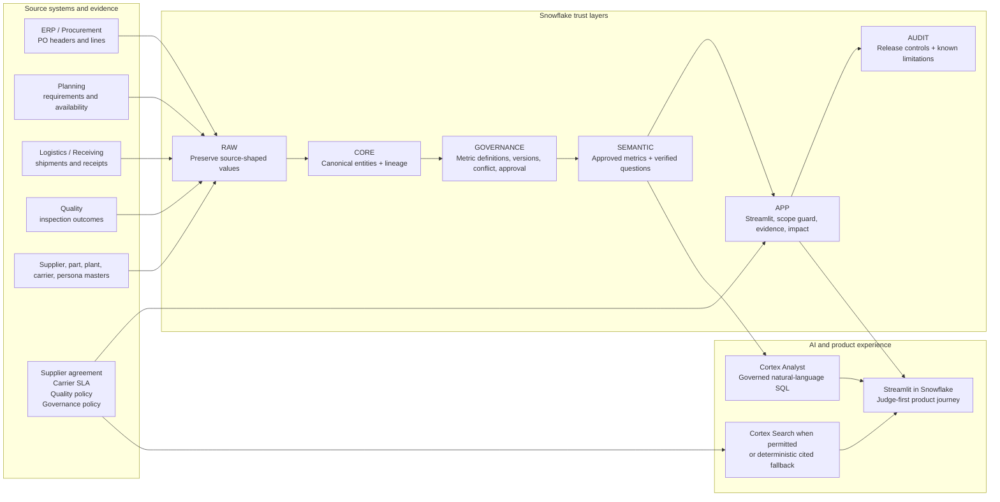
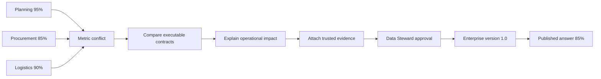
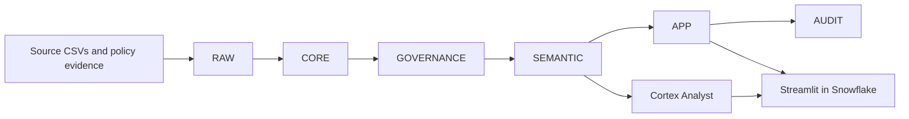
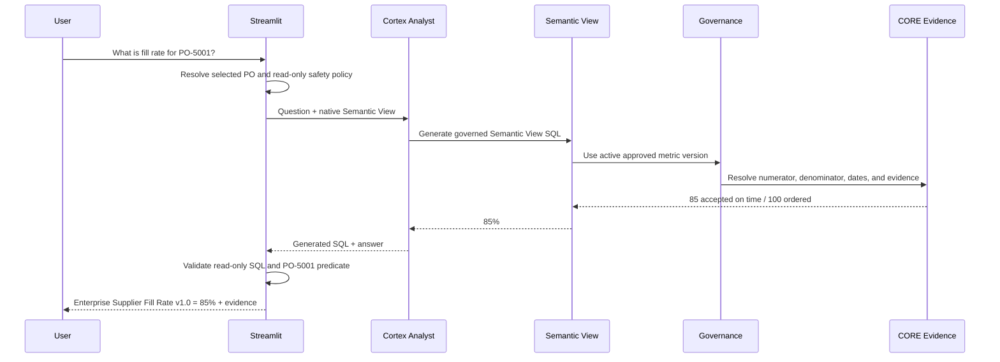
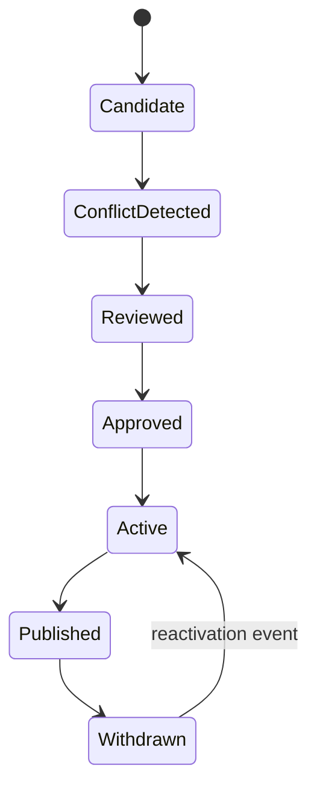
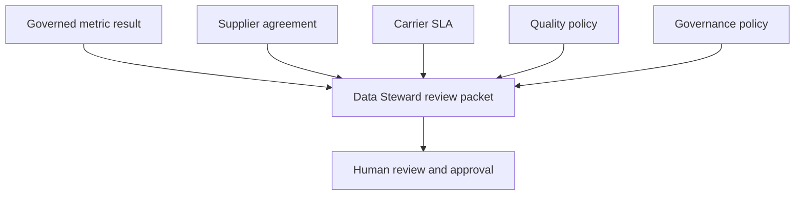

# ChainProof Architecture

ChainProof is a Snowflake-native metric trust and reconciliation platform for supply-chain AI. It keeps operational facts, metric contracts, human governance decisions, published semantic definitions, application presentation, and audit evidence in separate layers so that a conversational answer cannot silently use the wrong KPI definition.

## Architecture at a glance

## What the architecture proves

- **Operational facts are not metric rules.** Purchase orders, receipts, inspections, and production requirements are stored separately from the formulas that interpret them.
- **Metric disagreement is governed before publication.** Planning, Procurement, and Logistics definitions can coexist, be compared, and remain auditable without becoming trusted enterprise answers automatically.
- **Only an approved version reaches conversational analytics.** The active Enterprise Supplier Fill Rate version is published through the native Semantic View.
- **The application stays thin.** Streamlit reads governed Snowflake objects; it does not reimplement metric formulas in Python.
- **Evidence and limitations remain visible.** Trusted policy evidence, release controls, and unavailable account capabilities are recorded rather than hidden.

## Data sources

### Structured data

| Source | Representative records | Business purpose |
|---|---|---|
| ERP / Procurement | PO headers, PO lines, requested dates, ordered quantity, supplier code | Supplier commercial commitment |
| Planning | Part-plant need dates, required quantity, usable quantity available | Production readiness and shortage impact |
| Logistics / Receiving | Shipments, shipment lines, carrier commitments, receipts | Physical-arrival performance |
| Quality Inspection | Inspected, accepted, rejected, and damaged quantity | Determines whether received material is usable |
| Master Data | Suppliers, parts, plants, carriers | Canonical identity and relationships |
| Identity / Persona Mapping | Snowflake user, default persona, plant scope, approval indicator | Presentation defaults and future authorization mapping |

### Unstructured evidence

| Document | Why it matters |
|---|---|
| Supplier agreement | Supports the original purchase-order commitment and acceptable-quantity interpretation |
| Carrier SLA | Separates physical-arrival accountability from later quality acceptance |
| Pune quality policy | Explains why rejected or damaged quantity is not usable |
| Enterprise metric-governance policy | Supports approval, versioning, activation, publication, and rollback behavior |

The MVP uses deterministic synthetic source files so that every calculation and edge case is reproducible. The same architecture can connect to live ERP, TMS, WMS, MES, and document repositories without changing the governance model.

## Diagram 1 - Business conflict and governance lifecycle

The three department values are not treated as bad data. They answer different questions:

- **Planning:** was usable material available by the production need date?
- **Procurement:** was acceptable quantity received by the original PO requested date?
- **Logistics:** did physical quantity arrive by the original carrier commitment?

## Diagram 2 - Snowflake-native system

| Schema | Purpose | Representative objects |
|---|---|---|
| **RAW** | Preserve source exports as supplied, including deliberate edge cases | source-shaped tables, file metadata |
| **CORE** | Type, normalize, connect, and retain lineage | supplier, part, plant, PO, shipment, receipt, inspection, requirement |
| **GOVERNANCE** | Represent metric identity, versions, components, conflict, approval, activation, persona mapping | metric registry, approval events, active-version views |
| **SEMANTIC** | Publish only approved logical tables, relationships, metrics, and verified questions | CHAINPROOF_SUPPLY_CHAIN_SV |
| **APP** | Serve judge-facing views, Streamlit, question-scope guard, impact, and evidence | conflict scanner, calculation evidence, review packet |
| **AUDIT** | Store release snapshots, control results, and known limitations | release-health and limitation views |

## Diagram 3 - Governed question sequence

For a selected-Purchase-Order question, the application rejects generated SQL that does not contain the required PO predicate. A deterministic Semantic View query is used as a scope-correct fallback rather than showing an unscoped enterprise aggregate.

## Diagram 4 - Metric version lifecycle

Approved versions are immutable. A rollback changes activation history; it does not rename, overwrite, or delete an old metric contract.

## Diagram 5 - Evidence-backed decision packet

Evidence retrieval is capability-adaptive:

- When Cortex Search privileges are available, trusted evidence is retrieved through the Search service.
- When those privileges are unavailable, the application uses an explicitly labeled deterministic cited fallback.
- An untrusted prompt-injection fixture is excluded from the trusted source.

## Diagram 6 - CoCo CLI-assisted delivery lifecycle

| Skill / behavior | How it connects to the system |
|---|---|
| Repository inspection and plan mode | Establishes file/object scope before changes |
| SQL generation | Builds RAW, CORE, GOVERNANCE, SEMANTIC, APP, and AUDIT objects |
| Python and Streamlit scaffolding | Implements the UI, scope checks, evidence logic, and certification utilities |
| Test generation | Creates local static tests and Snowflake fail-fast assertions |
| Snowflake CLI orchestration | Executes deterministic builds, stage loads, validation, and deployment |
| Documentation generation | Records metric contracts, architecture, evidence, known limitations, and judge guidance |
| Debugging and correction | Uses actual runtime errors to refine bounded code changes |

Human decisions remain explicit: metric approval, account privilege grants, production release, and final submission are not delegated to an autonomous agent.

## Modular component map

| Module | Input | Output | Can be replaced independently? |
|---|---|---|---|
| Source ingestion | CSV exports / future enterprise connectors | RAW source tables | Yes - add connectors without changing governance |
| Canonical layer | RAW source tables | typed CORE entities + lineage | Yes - mapping rules can evolve independently |
| Metric governance | CORE evidence + approved business contract | versioned definitions, conflicts, approvals, activation | Yes - new KPIs reuse the same model |
| Semantic publication | active approved metric versions | native Semantic View + verified questions | Yes - publish by domain or effective period |
| Conversational analytics | user question + Semantic View | governed SQL and answer | Yes - Cortex Analyst remains separated from metric approval |
| Evidence retrieval | trusted policy documents | cited passages / review packet | Yes - native Search or deterministic fallback |
| Product UI | APP views + Analyst + evidence | persona-aware Streamlit experience | Yes - frontend stays thin |
| Release assurance | layer tests + manual UI checks | AUDIT control results and limitation register | Yes - new controls can be added without formula changes |

## Twelve-part build path

- **Parts 1-3** — Foundation: environment, toolchain, business contract
- **Parts 4-5** — Data: RAW ingestion and canonical CORE
- **Parts 6-7** — Trust: metric governance, versions, Semantic View, Cortex Analyst
- **Parts 8-10** — Product: Streamlit, evidence, security, audit, deployment hardening
- **Parts 11-12** — Submission: README, deck, video, judge guide, final certification

This sequence demonstrates a prompt-driven but controlled development method: CoCo CLI assisted planning and implementation, deterministic scripts verified each stage, and humans retained business and release authority.

## Architecture principles

1. **Preserve before cleaning** - RAW retains malformed and incomplete source values.
2. **Canonicalize once** - CORE provides connected, typed entities and lineage.
3. **Version the rule** - GOVERNANCE stores metric contracts and decision history.
4. **Publish only approved definitions** - SEMANTIC excludes candidate and deprecated ambiguity.
5. **Keep the application thin** - Streamlit presents governed Snowflake results rather than duplicating formulas.
6. **Enforce question scope** - selected-PO questions must contain the correct Semantic View predicate.
7. **Expose evidence** - every trusted answer can show quantities, dates, version, and policy context.
8. **Separate persona from authorization** - View as changes presentation, not Snowflake permissions or formulas.
9. **Fail visibly** - unavailable capabilities are labeled; no fabricated AI result is shown.
10. **Audit the release** - automated controls, manual checks, and account limitations remain reviewable.

## Key Snowflake capabilities used

| Capability | How ChainProof uses it |
|---|---|
| Snowflake SQL and internal stages | Deterministic data loading and schema builds |
| Snowflake CLI | Repeatable execution, deployment, and validation |
| Native Semantic View | Approved metric definitions, dimensions, relationships, and verified questions |
| Cortex Analyst | Natural-language questions resolved to governed Semantic View SQL |
| Cortex Search | Trusted evidence retrieval when current-role privileges permit |
| Streamlit in Snowflake | Seven-stage judge-first product experience |
| Snowpark session execution | Read-only result execution inside the hosted application |
| AUDIT schema | Release snapshots, control results, and known limitations |
| CoCo CLI | Plan-driven repository and Snowflake development workflow |

## Scalability and production path

The MVP intentionally uses one plant and one component so that the metric disagreement is easy to inspect. The same model scales by:

- adding parts, plants, suppliers, countries, and historical periods in RAW and CORE;
- defining reusable dimensions and relationships in the Semantic View;
- applying versioned metric contracts by effective date and business domain;
- connecting enterprise ERP, TMS, WMS, MES, and document repositories;
- introducing dedicated application-owner, viewer, Data Steward, and action-approver roles;
- adding secure approval procedures, row-access policies, monitoring, and production audit;
- extending the lifecycle to OTIF, forecast accuracy, inventory availability, landed cost, supplier quality, and other disputed KPIs.

The differentiator remains the same at scale:

> Semantic layers govern agreed metrics. ChainProof governs the disagreement that exists before agreement.
