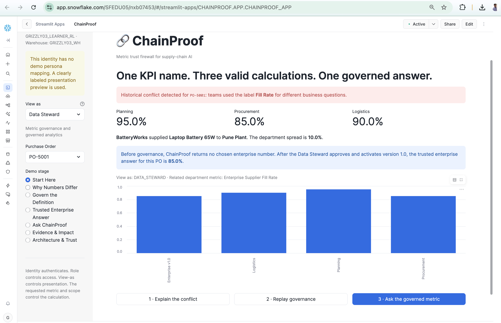
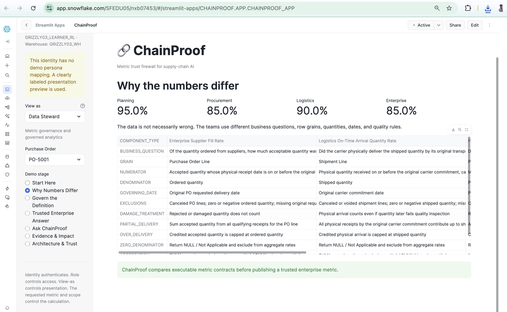
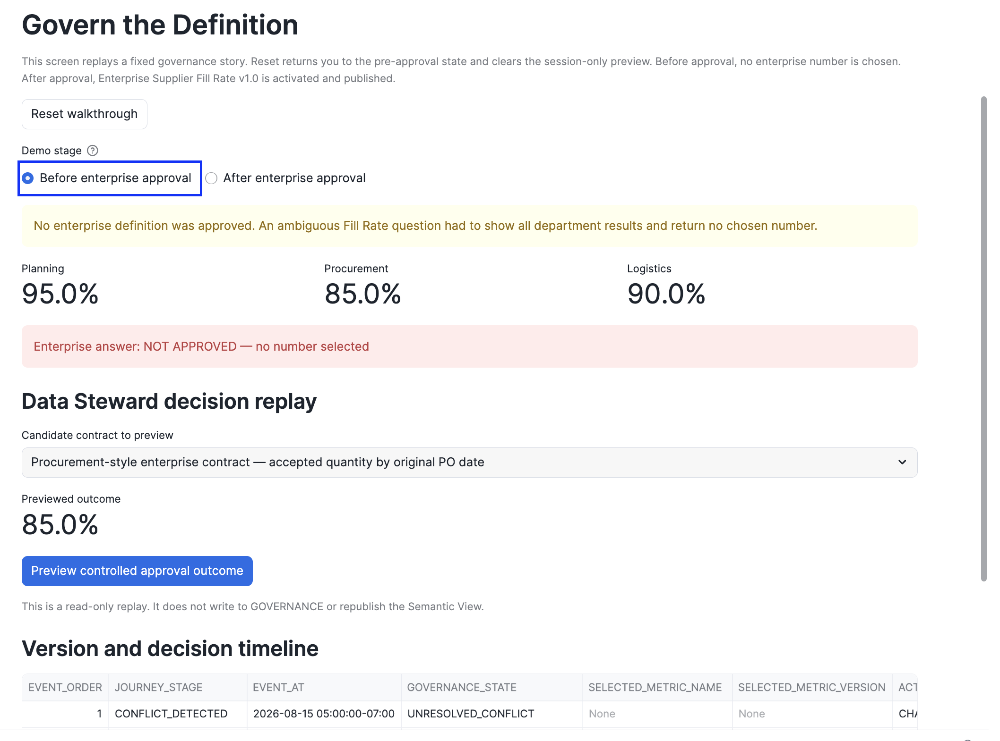
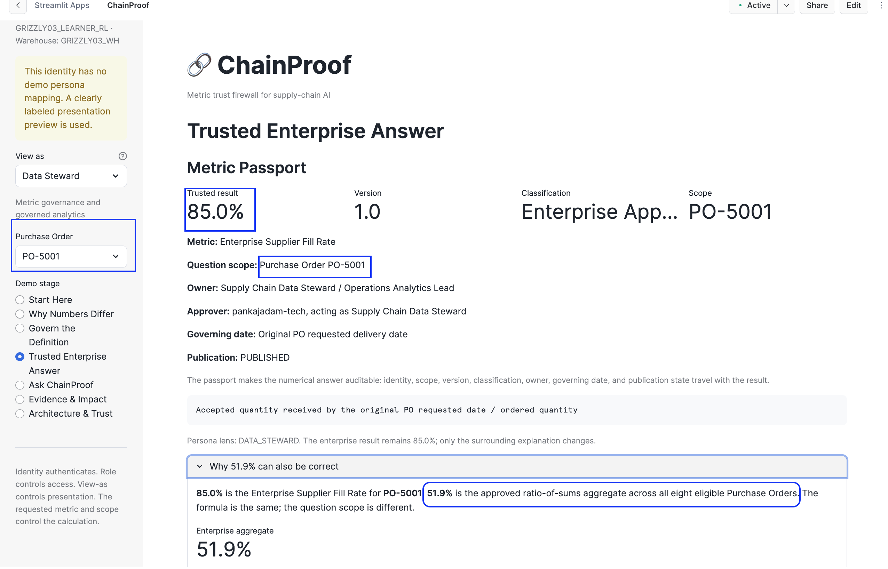
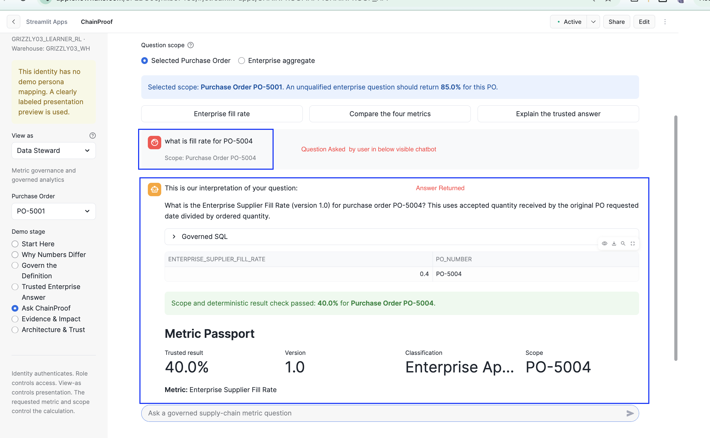
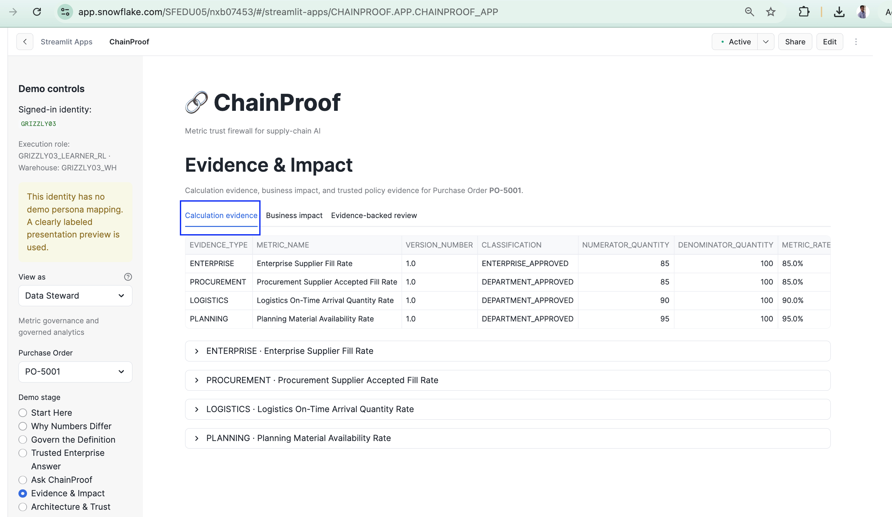
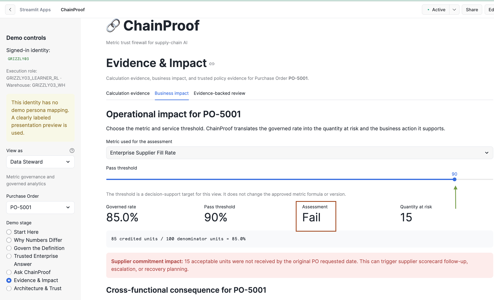
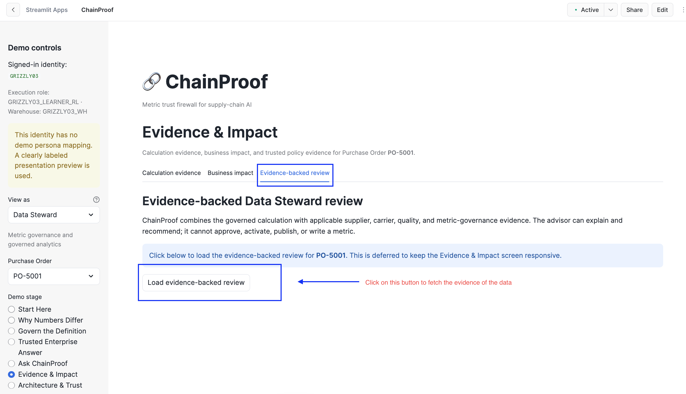
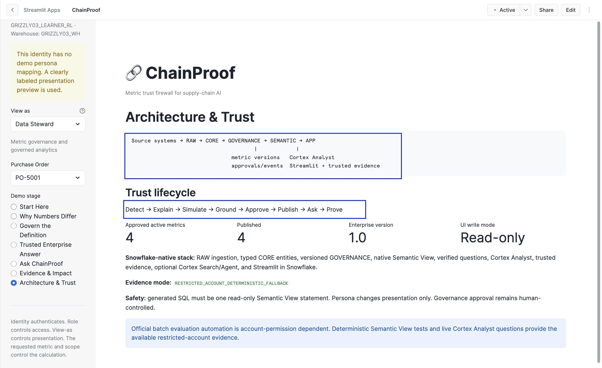

# ChainProof Judge Guide

## Purpose

This is the single detailed walkthrough for reviewing ChainProof. It is written so that a judge can understand and validate the product without a team member being present.

## Quick links

- Live application: [Open ChainProof](https://app.snowflake.com/SFEDU05/nxb07453/#/streamlit-apps/CHAINPROOF.APP.CHAINPROOF_APP)
- 4-5 minute walkthrough: [Watch video](assets/chainproof-snowflake.mov)
- Presentation: [PPTX](../submission/ChainProof_Hackathon_Presentation.pptx) · [PDF](../submission/ChainProof_Hackathon_Presentation.pdf)
- Architecture: [ARCHITECTURE.md](ARCHITECTURE.md)
- Technical detail: [TECHNICAL_APPENDIX.md](TECHNICAL_APPENDIX.md)
- Validation: [VALIDATION_SUMMARY.md](VALIDATION_SUMMARY.md)

## The story in one sentence

> Planning says 95%, Procurement says 85%, and Logistics says 90%. ChainProof explains why all three are valid, lets a Data Steward govern the enterprise definition, and makes Cortex Analyst answer with the approved 85% definition and calculation evidence.

## Before opening the app

The application runs in Streamlit in Snowflake. A Snowflake login may be required.

If the app cannot be opened from the judging environment:

1. Watch the walkthrough video.
2. Open the screenshots listed in `docs/assets/screenshots/`.
3. Review the presentation PDF.
4. Use the repository and validation evidence for technical inspection.

No credentials are provided in the repository.

## Important UI concepts

### Signed-in identity

This is the real Snowflake user opening the application.

### Execution role

This is the Snowflake role under which the application executes. The hackathon learner account uses one primary development role.

### View as

`View as` demonstrates the presentation lens for a persona. It answers:

> “Had a Planning, Procurement, Logistics, Data Steward, or Operations Leader user opened the product, which context and supporting details would be emphasized?”

It does **not** impersonate a different Snowflake user and does not grant permissions. The account did not provide the full production role hierarchy, so ChainProof keeps the distinction explicit:

- role controls access;
- `View as` controls presentation;
- the requested metric and scope control the calculation.

Only `View as = Data Steward` exposes the session-only governance preview control. The control is a demo replay, not a production approval write.

### Purchase Order

Use `PO-5001` for the primary story.

### Demo stage

This chooses which part of the governance journey is shown. It does not change the governed data.

---

# Recommended 4-minute review path

## Step 1 - Open “Start Here”



Set:

```text
View as: Data Steward
Purchase Order: PO-5001
Demo stage: Start Here
```

Expected values:

```text
Planning       95%
Procurement    85%
Logistics      90%
```

Expected message:

```text
Historical metric conflict detected.
```

What this proves:

- the same business label was used for different calculations;
- the product does not declare two teams “wrong” merely because values differ;
- ChainProof treats metric meaning as a governance problem.

## Step 2 - Open “Why Numbers Differ”



Inspect the side-by-side comparison of:

```text
business question
grain
numerator
denominator
governing date
damage treatment
partial delivery
over-delivery cap
aggregation
```

Expected explanation:

- Planning asks whether the plant can build on the production need date.
- Procurement asks whether acceptable quantity arrived by the original PO date.
- Logistics asks whether physical quantity arrived by the carrier commitment.

## Step 3 - Open “Govern the Definition”



Choose:

```text
Before enterprise approval
```

Expected:

```text
Planning      95%
Procurement   85%
Logistics     90%
Enterprise    NOT APPROVED - no number selected
```

The Data Steward-only button should be visible:

```text
Preview controlled approval outcome
```

Click it.

Expected preview:

```text
Candidate Enterprise Supplier Fill Rate
Version to create: 1.0
Result for PO-5001: 85%
```

The preview must say it is session-only and read-only.

### Persona check

Change `View as` to Planning, Procurement, Logistics, and Operations Leader. The preview control must be absent. Return to Data Steward afterward.

## Step 4 - Open “Trusted Enterprise Answer”



Choose the current approved state.

Expected:

```text
Enterprise Supplier Fill Rate
Version 1.0
Enterprise - Approved
PO-5001 result: 85%
Approved, activated, and published
```

Inspect the metric passport:

```text
metric name
scope
version
classification
owner
approver
governing date
calculation
publication status
```

## Step 5 - Open “Ask ChainProof”



Set:

```text
Question scope: Selected Purchase Order
Purchase Order: PO-5001
```

Ask exactly:

```text
What is fill rate for PO-5001?
```

Expected answer:

```text
Interpreted as Enterprise Supplier Fill Rate
Version 1.0
85%
```

Expected safety behavior:

- generated SQL is read-only;
- it queries the Semantic View;
- it includes the PO-5001 scope;
- it does not query RAW, CORE, or GOVERNANCE directly.

### Scope contrast

Change question scope to:

```text
Enterprise aggregate
```

Ask:

```text
What is Enterprise Supplier Fill Rate?
```

Expected:

```text
51.9% = 288 / 555
```

This is intentionally different from the PO-specific 85% result. The UI makes the scope explicit.

## Step 6 - Open “Evidence & Impact”



### Calculation evidence

Expected for PO-5001:

```text
85 accepted by original PO requested date
÷
100 ordered
=
85%
```

Inspect the PO, shipment, receipt, inspection, and original-date evidence.

### Business impact



Keep `Purchase Order = PO-5001`. Open `Business impact`, select `Enterprise Supplier Fill Rate`, and keep the threshold at `90%`.

Expected:

```text
Governed rate:             85%
Assessment:                Fail
Supplier quantity at risk: 15 units
Late physical quantity:    10 units
Production shortage:        5 units
```

This is the practical consequence of the metric conflict. Procurement can escalate the 15-unit supplier shortfall, Logistics can investigate the 10 late units, and Planning can mitigate the 5-battery shortage. The figures differ because the functions own different responsibilities.

### Evidence-backed review



Return to PO-5001 and open:

```text
Evidence-backed review
```

The page should initially show:

```text
Load evidence-backed review
```

Click it once. Expected trusted evidence:

- BatteryWorks supplier agreement
- inbound carrier SLA
- Pune quality-acceptance policy
- enterprise metric-governance policy

Every retrieved passage must show a citation. The untrusted prompt-injection fixture must not appear.

Changing the PO must clear the old packet and restore the load button; this prevents stale evidence and avoids unnecessary page latency.

## Step 7 - Open “Architecture & Trust”



Review:

```text
RAW → CORE → GOVERNANCE → SEMANTIC → APP → AUDIT
```

Also review:

- metric versioning and activation events;
- verified queries;
- generated SQL safety;
- evidence trust boundary;
- account limitations;
- deterministic certification.

---

# What the judge should conclude

1. The product solves metric ambiguity before AI analytics.
2. The enterprise definition is a human governance decision, not an AI guess.
3. Persona changes explanation, not formula.
4. Question scope is explicit and enforced.
5. Only the approved version reaches the Semantic View.
6. Answers include calculation and evidence.
7. Account restrictions are documented truthfully, with safe fallbacks.

# Known account limitations

The following are not product failures:

- Official Cortex Analyst batch evaluation could not run because the learner role lacks task and dataset privileges.
- Full production RBAC could not be provisioned in the shared learner account.
- The Data Steward approval preview is session-only rather than a persistent write.
- Native Cortex Search/Agent are used only when the account grants their object privileges; otherwise a deterministic evidence fallback is displayed.

The live Cortex Analyst runtime, Streamlit application, governed metrics, evidence workflow, and deterministic tests remain functional.
