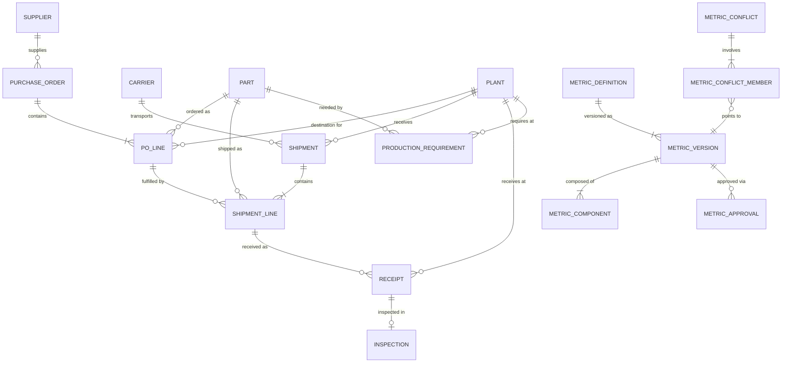

# Ontology

## Overview

This document defines every entity in the ChainProof data model — what it means
in plain language, what one row represents, its business key, important
attributes, source ownership, and relationships.

No physical SQL table definitions are included. This is the logical business
model that will guide Part 4 (data generation) and Part 5 (CORE layer
implementation).

Entities are split into two groups:
- **Operational entities** represent supply-chain business events and master data.
- **Governance entities** represent metric definitions, conflicts, and approvals.

---

## Operational Entities

### Supplier

**Meaning:** An external company that sells components to the manufacturer.

**What one row represents:** One supplier organization.

**Laptop-component example:** BatteryWorks — a lithium-ion battery manufacturer.

**Business key:** `supplier_id`

**Important attributes:** supplier name, location, status (active/inactive).

**Source ownership:** Supplier Master.

**Where it appears in Snowflake:** `CHAINPROOF.CORE`

---

### Part

**Meaning:** A purchased component type used in manufacturing.

**What one row represents:** One distinct part (SKU-level).

**Laptop-component example:** Laptop Battery (P-2001), measured in units (each).

**Business key:** `part_id`

**Important attributes:** part name, category, base unit of measure.

**Source ownership:** ERP Master Data.

**Where it appears in Snowflake:** `CHAINPROOF.CORE`

---

### Plant

**Meaning:** A manufacturing facility that receives components and produces
finished goods.

**What one row represents:** One plant location.

**Laptop-component example:** Pune Plant (PLT-01).

**Business key:** `plant_id`

**Important attributes:** plant name, location, status.

**Source ownership:** ERP Master Data.

**Where it appears in Snowflake:** `CHAINPROOF.CORE`

---

### Carrier

**Meaning:** A transportation company that physically delivers shipments from
suppliers to plants.

**What one row represents:** One carrier organization.

**Laptop-component example:** The freight company transporting batteries from
BatteryWorks' warehouse to Pune Plant.

**Business key:** `carrier_id`

**Important attributes:** carrier name, mode (air/sea/road), status.

**Source ownership:** Logistics / Receiving System.

**Where it appears in Snowflake:** `CHAINPROOF.CORE`

---

### Purchase Order

**Meaning:** A formal request from the manufacturer to a supplier for components.

**What one row represents:** One purchase order header.

**Laptop-component example:** PO-5001 from Pune Plant to BatteryWorks.

**Business key:** `po_number`

**Important attributes:** supplier reference, destination plant, PO date, status.

**Source ownership:** ERP / Procurement System.

**Where it appears in Snowflake:** `CHAINPROOF.CORE`

**Relationships:**
- One supplier has many purchase orders.
- One purchase order has many PO lines.

---

### Purchase Order Line

**Meaning:** A single line item on a purchase order specifying one part, quantity,
and delivery expectation.

**What one row represents:** One part-quantity-date commitment on a PO.

**Laptop-component example:** PO-5001 line 1: 100 Laptop Batteries requested by
August 8 to Pune Plant.

**Business key:** `po_number` + `po_line_number`

**Important attributes:** part reference, ordered quantity, original requested
delivery date, revised requested delivery date, destination plant, unit price,
line status.

**Source ownership:** ERP / Procurement System.

**Why it matters to ChainProof:** This is the grain for the Procurement and
Enterprise metrics. The ordered quantity is the denominator; the original
requested date is the governing date.

**Where it appears in Snowflake:** `CHAINPROOF.CORE`

**Relationships:**
- One purchase order has many PO lines.
- One PO line may have many shipment lines.
- One part appears on many PO lines.
- One plant receives many PO lines.

---

### Shipment

**Meaning:** A physical transport event carrying goods from a supplier to a plant.

**What one row represents:** One shipment (a truck load, container, or parcel).

**Laptop-component example:** SH-9001 carrying 90 batteries from BatteryWorks
to Pune Plant.

**Business key:** `shipment_id`

**Important attributes:** carrier reference, origin, destination plant, ship date.

**Source ownership:** Logistics / Receiving System.

**Where it appears in Snowflake:** `CHAINPROOF.CORE`

**Relationships:**
- One carrier has many shipments.
- One shipment has many shipment lines.
- One plant receives many shipments.

---

### Shipment Line

**Meaning:** A line within a shipment that fulfills (part of) a purchase order
line.

**What one row represents:** One part-quantity shipped against one PO line.

**Laptop-component example:** SH-9001 line 1 ships 90 Laptop Batteries against
PO-5001 line 1.

**Business key:** `shipment_id` + `shipment_line_number`

**Important attributes:** PO line reference, part reference, shipped quantity,
original carrier commitment date, revised carrier commitment date.

**Source ownership:** Logistics / Receiving System.

**Why it matters to ChainProof:** This is the grain for the Logistics metric.
Shipped quantity is the denominator; the original carrier commitment date is the
governing date.

**Where it appears in Snowflake:** `CHAINPROOF.CORE`

**Relationships:**
- Each shipment line fulfills exactly one PO line (in the MVP).
- One PO line may have many shipment lines.
- One shipment has many shipment lines.
- One shipment line may have one or more receipt events.

---

### Receipt

**Meaning:** A physical receiving event at the plant — the moment goods are
counted as physically arrived.

**What one row represents:** One receipt event for a shipment line.

**Laptop-component example:** Pune Plant warehouse receives 90 batteries from
SH-9001 on August 8.

**Business key:** `receipt_id`

**Important attributes:** shipment line reference, physical receipt quantity,
receipt date, receiving dock/location.

**Source ownership:** Logistics / Receiving System.

**Why it matters to ChainProof:** The receipt date is used by Procurement and
Enterprise metrics to determine whether goods arrived by the governing date.
Physical receipt quantity is what Logistics credits for on-time performance.

**Where it appears in Snowflake:** `CHAINPROOF.CORE`

**Relationships:**
- One shipment line may have one or more receipt events.
- Each receipt has zero or one final inspection outcome (in the MVP).
- One plant receives many receipts.

---

### Inspection

**Meaning:** A quality-inspection event that determines whether received goods
are acceptable (usable) or rejected (damaged).

**What one row represents:** One final inspection outcome for a receipt event.

**Laptop-component example:** Of the 90 batteries received in SH-9001's receipt,
inspection accepts 85 and rejects 5 as damaged.

**Business key:** `inspection_id`

**Important attributes:** receipt reference, accepted quantity, rejected quantity,
damaged quantity, inspection date, disposition.

**Source ownership:** Quality-Inspection System.

**Why it matters to ChainProof:** Accepted quantity is the numerator (or
numerator input) for Planning, Procurement, and Enterprise metrics. Without
inspection, we cannot distinguish arrived from usable. Pending inspection
quantity is not accepted quantity.

**Where it appears in Snowflake:** `CHAINPROOF.CORE`

**Relationships:**
- Each receipt has zero or one final inspection outcome (in the MVP).

---

### Production Requirement

**Meaning:** A demand signal from the production plan stating how many usable
components the plant needs by a specific date.

**What one row represents:** One part-plant-date demand requirement.

**Laptop-component example:** Pune Plant needs 100 usable Laptop Batteries by
August 12 to produce 100 laptops.

**Business key:** `part_id` + `plant_id` + `need_date`

**Important attributes:** required quantity, usable quantity available by need
date, production need date, planning record timestamp, requirement status,
associated production order/plan reference.

**Source ownership:** Planning System.

**Why it matters to ChainProof:** This is the grain for the Planning metric.
Required quantity is the denominator; the production need date is the governing
date.

**Where it appears in Snowflake:** `CHAINPROOF.CORE`

**Relationships:**
- One part appears on many production requirements.
- One plant has many production requirements.

---

## Governance Entities

### Metric Definition

**Meaning:** A named, governed business metric with a stable identity across
versions.

**What one row represents:** One logical metric (e.g., "Enterprise Supplier Fill Rate").

**Business key:** `metric_id`

**Important attributes:** metric name, current classification (Enterprise Approved,
Department Approved, Candidate Conflicting, Deprecated Ambiguous), owning
department or role.

**Where it appears in Snowflake:** `CHAINPROOF.GOVERNANCE`

**Relationships:**
- One metric definition has many versions.

---

### Metric Version

**Meaning:** A specific versioned formula for a metric definition.

**What one row represents:** One version (e.g., version 1.0) of a metric's formula.

**Business key:** `metric_id` + `version_number`

**Important attributes:** version number, status (draft, proposed, approved,
deprecated), effective date, grain description, numerator definition, denominator
definition, governing date field, exclusion rules, aggregation method.

**Where it appears in Snowflake:** `CHAINPROOF.GOVERNANCE`

**Relationships:**
- One metric definition has many versions.
- One metric version has many components.
- One metric version has many approval events.

---

### Metric Component

**Meaning:** A building block of a metric version's formula — typically the
numerator rule, denominator rule, or an exclusion/filter rule.

**What one row represents:** One component of a versioned metric formula.

**Business key:** `metric_id` + `version_number` + `component_id`

**Important attributes:** component type (numerator, denominator, filter,
exclusion), definition text, source entity references.

**Where it appears in Snowflake:** `CHAINPROOF.GOVERNANCE`

**Relationships:**
- One metric version has many components.

---

### Metric Conflict

**Meaning:** A detected governance issue where two or more metric definitions use
the same or confusingly similar label but differ in business question, grain,
numerator, denominator, governing date, exclusions, or calculation behavior.

**What one row represents:** One conflict instance.

**Laptop-component example:** "Fill Rate" is used by Planning (95%, material
availability by need date), Procurement (85%, accepted quantity by PO date), and
Logistics (90%, physical arrival by carrier commitment). They ask different
business questions but share an ambiguous label.

**Business key:** `conflict_id`

**Important attributes:** conflict description, status (open, resolved,
escalated), detection date.

**Where it appears in Snowflake:** `CHAINPROOF.GOVERNANCE`

**Relationships:**
- One conflict has two or more conflict members.

---

### Metric Conflict Member

**Meaning:** A link between a conflict and one of the metric versions involved.

**What one row represents:** One metric version's participation in a conflict.

**Business key:** `conflict_id` + `metric_id` + `version_number`

**Important attributes:** role in conflict (e.g., the department metric that
disagrees with the proposed enterprise definition).

**Where it appears in Snowflake:** `CHAINPROOF.GOVERNANCE`

**Relationships:**
- Each conflict member points to one metric version.
- One conflict has two or more conflict members.

---

### Metric Approval

**Meaning:** A governance event recording a human decision to approve, reject,
or defer a metric version.

**What one row represents:** One approval decision by an authorized user.

**Business key:** `approval_id`

**Important attributes:** metric version reference, approver identity, decision
(approved, rejected, deferred), decision date, effective date, comments.

**Where it appears in Snowflake:** `CHAINPROOF.GOVERNANCE`

**Relationships:**
- One metric version has many approval events (history).

---

### User Persona Map

**Meaning:** Application-level configuration mapping a user to their default
persona and plant context.

**What one row represents:** One user's application defaults.

**Laptop-component example:** User "priya.logistics" defaults to the Logistics
persona with Pune Plant context.

**Business key:** `user_id`

**Important attributes:** default persona, default plant, metric approval
authority flag.

**Where it appears in Snowflake:** `CHAINPROOF.GOVERNANCE`

**Critical boundary:** This controls application presentation defaults only.
Snowflake roles control data access authorization. The User Persona Map must
never replace or imitate Snowflake role-based authorization.

---

## Relationship Diagram

### Reading the Diagram

- `||--|{` means "one to many" (mandatory on both sides).
- `||--o{` means "one to zero-or-many."
- `||--o|` means "one to zero-or-one."
- `}o--||` means "many to one."

### Key Relationship Rules (MVP)

1. Each shipment line fulfills exactly one PO line.
2. Each receipt has zero or one final inspection outcome.
3. One conflict has two or more conflict members.
4. User Persona Map controls application defaults only; Snowflake roles
   control authorization.
5. Original dates drive version 1.0 metric performance. Revised dates are
   retained as explanatory context but do not change the numerator.
